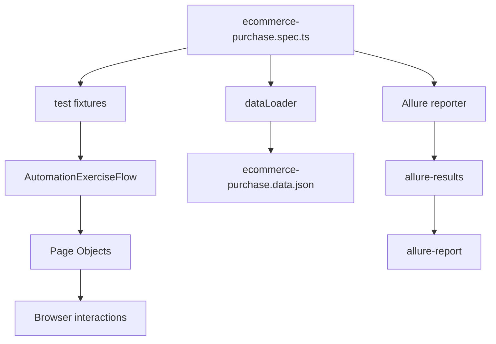

# AIAgentsWithSkills - Playwright + Allure E2E Automation Framework

This repository is a TypeScript E2E test automation project built with Playwright and Allure reporting.
It currently automates an end-to-end ecommerce purchase journey on Automation Exercise, with:

- Page Object Model (POM)
- Typed fixtures
- Data-driven scenarios from JSON
- Positive, negative, and boundary coverage patterns
- Rich Allure reports

## 1. What This Project Does

The framework runs browser-based tests that validate a realistic user flow:

1. Register a new user
2. Add a product to cart
3. Checkout
4. Complete payment
5. Download invoice

It also demonstrates:

- Negative validation for signup data
- Boundary validation for product quantity in cart

## 2. Tech Stack

- Node.js + npm
- TypeScript
- Playwright (`@playwright/test`)
- Allure Playwright reporter (`allure-playwright`)
- Allure CLI (`allure-commandline`)

## 3. Current Project Layout

```text
.
|-- package.json
|-- playwright.config.ts
|-- tests/
|   |-- smoke.spec.ts
|   |-- fixtures/
|   |   `-- test-fixtures.ts
|   |-- pages/
|   |   |-- BasePage.ts
|   |   |-- HomePage.ts
|   |   |-- AuthPage.ts
|   |   |-- ProductsPage.ts
|   |   |-- ProductDetailsPage.ts
|   |   |-- CartPage.ts
|   |   |-- CheckoutPage.ts
|   |   `-- PaymentPage.ts
|   |-- specs/
|   |   `-- ecommerce-purchase.spec.ts
|   |-- data/
|   |   `-- ecommerce-purchase.data.json
|   |-- types/
|   |   `-- ecommerce-purchase.types.ts
|   `-- utils/
|       |-- AutomationExerciseFlow.ts
|       |-- dataLoader.ts
|       `-- testData.ts
|-- allure-results/
`-- allure-report/
```

## 4. How The Framework Is Designed

### 4.1 Layered architecture

The framework has clear layers:

- **Test spec layer**: defines scenarios and assertions at business-flow level.
- **Flow/orchestration layer**: composes multiple page actions into reusable workflow methods.
- **Page Object layer**: encapsulates selectors and UI interactions per screen.
- **Data + typing layer**: scenario data comes from JSON and is validated by TypeScript types.

### 4.2 Execution flow (conceptual)



## 5. Key Files Explained In Depth

### 5.1 Playwright configuration

`playwright.config.ts` sets:

- `testDir: './tests'`
- reporters:
  - console list reporter
  - Allure reporter writing into `allure-results`
- `use.baseURL: 'https://www.automationexercise.com'`
- `use.trace: 'on-first-retry'`

Why this matters:

- Base URL keeps page navigation concise (`goto('/')` style).
- Trace-on-retry keeps debugging detail available only when needed.
- Dual reporting gives immediate console feedback and richer historical output.

### 5.2 Test fixture composition

`tests/fixtures/test-fixtures.ts` extends Playwright's `test` with custom fixtures:

- `homePage`, `authPage`, `productsPage`, `productDetailsPage`
- `cartPage`, `checkoutPage`, `paymentPage`
- `automationExerciseFlow`

Why this matters:

- Test files become clean and intent-focused.
- Page creation boilerplate is centralized.
- The flow object is dependency-injected and consistent across tests.

### 5.3 Flow orchestration utility

`tests/utils/AutomationExerciseFlow.ts` defines end-to-end reusable actions such as:

- `registerNewUser(...)`
- `addProductToCart(...)`
- `proceedFromCartToOrderPlacement()`
- `submitPaymentAndDownloadInvoice(...)`
- `addProductAndVerifyQuantity(...)`

Why this matters:

- Reduces duplication in specs.
- Improves readability by expressing business intent.
- Makes test maintenance easier when UI changes.

### 5.4 Page Objects

Each page object holds selectors plus actions for one area of the app:

- `HomePage.ts` - open auth/products, assert logged-in state.
- `AuthPage.ts` - signup and account details workflow.
- `ProductsPage.ts` - locate product card by name and open details.
- `ProductDetailsPage.ts` - set quantity and add to cart.
- `CartPage.ts` - proceed to checkout and verify cart quantity.
- `CheckoutPage.ts` - place order action.
- `PaymentPage.ts` - fill payment details, submit, verify order, download invoice.

Notable implementation detail:

- `CartPage.ts` uses CSS locator `a.check_out` for checkout due to inconsistent accessibility tree behavior for that control on the target site.

### 5.5 Data-driven testing

Data is loaded from:

- `tests/data/ecommerce-purchase.data.json`

and typed by:

- `tests/types/ecommerce-purchase.types.ts`

Spec behavior in `tests/specs/ecommerce-purchase.spec.ts`:

- loops `purchaseCases` to run positive purchase scenarios
- loops `negativeCases` for invalid signup checks
- loops `boundaryCases` for quantity boundaries

Why this matters:

- New coverage is often a data update, not a code change.
- Type safety catches shape drift early.
- Test cases stay standardized and scalable.

### 5.6 Utility helpers

- `tests/utils/dataLoader.ts` reads JSON from `tests/data` using `process.cwd()` as root.
- `tests/utils/testData.ts` builds unique email addresses with case-based slug + timestamp.

Unique email strategy avoids collisions when signup flows are executed repeatedly.

### 5.7 Sample smoke file

`tests/smoke.spec.ts` currently points to `https://playwright.dev/` and validates title.
This is a default-style Playwright smoke sample and separate from the Automation Exercise business flow tests.

## 6. Setup Guide

### 6.1 Prerequisites

- Node.js (LTS recommended)
- npm
- Internet access for the target site

### 6.2 Install dependencies

```bash
npm install
```

### 6.3 Install Playwright browsers

```bash
npx playwright install
```

## 7. Running Tests

### 7.1 Run all tests

```bash
npm test
```

### 7.2 Run tests in headed mode

```bash
npm run test:headed
```

### 7.3 Run only ecommerce spec

```bash
npx playwright test tests/specs/ecommerce-purchase.spec.ts
```

### 7.4 Run a single scenario by title grep

```bash
npx playwright test -g "purchase flow - new user completes checkout and downloads invoice"
```

## 8. Allure Reporting Workflow

### 8.1 Generate static report from latest results

```bash
npm run allure:generate
```

### 8.2 Open generated report

```bash
npm run allure:open
```

### 8.3 Generate and serve temporary report

```bash
npm run allure:serve
```

How it works:

- Test run writes raw artifacts to `allure-results`
- Allure CLI transforms those artifacts into HTML report in `allure-report`
- `allure open` displays existing report
- `allure serve` generates and serves in one step

## 9. How To Add New Coverage

### 9.1 Add a new positive purchase case

1. Open `tests/data/ecommerce-purchase.data.json`
2. Add another item to `purchaseCases`
3. Re-run tests

No spec logic changes are required if data shape remains valid.

### 9.2 Add a new boundary scenario

1. Add item in `boundaryCases`
2. Re-run tests

### 9.3 Add a new page interaction

1. Create method in the relevant file under `tests/pages`
2. Expose a business-level method in `AutomationExerciseFlow.ts`
3. Use it from spec with `test.step(...)`

Recommended style:

- Keep selectors in page objects only.
- Keep cross-page business flow in flow utility.
- Keep specs focused on intent and assertions.

## 10. Stability And Maintainability Notes

- Prefer role-based locators when reliable; use CSS fallback only when necessary.
- Keep test data realistic but non-sensitive.
- Use explicit assertions after major transitions (login, order placement, etc.).
- Keep scenarios independent to avoid shared state coupling.
- Preserve TypeScript types when data model evolves.

## 11. Troubleshooting

### Issue: Allure report is empty or stale

- Ensure tests were run first.
- Check `allure-results` contains fresh files.
- Regenerate using `npm run allure:generate`.

### Issue: Signup occasionally fails due to duplicate email

- Ensure tests use `uniqueEmail(...)` path.
- Avoid hard-coded static emails in purchase scenarios.

### Issue: Locator failures on dynamic UI

- Revalidate selectors in page objects.
- Favor resilient locators (`getByRole`, semantic text) where possible.
- Keep site-specific workarounds isolated in page classes.

## 12. Suggested Next Enhancements

- Add CI pipeline (GitHub Actions/Azure DevOps) to publish Allure artifacts.
- Add environment-driven `baseURL` and credentials using `.env` pattern.
- Add tags/annotations for regression, smoke, and critical flows.
- Add API or contract checks for hybrid UI + backend validation.
- Add retry strategy per project/environment profile.

---

If you want, this README can be extended further with:

- a CI YAML example,
- contribution standards,
- and a test case authoring template.

## Additional Documentation

- Agent and skill usage guide: `README-AGENTS-WITH-SKILLS.md`
